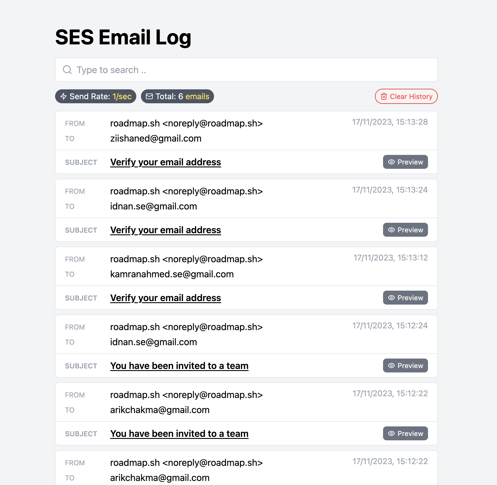

# ses-local

> Trap and test AWS SES emails locally



## Setup

You can simply use `docker` to run the service locally

```bash
docker run -d --name local-ses -p 8282:8282 kamranahmed/local-ses:latest
```

This will start the service on port `8282`. Next, modify your SES client to use the local service. 

For example, if you are using `aws-sdk` you can do something like

```javascript
import { SESClient, SendEmailCommand } from "@aws-sdk/client-ses";

const client = new SESClient({
  region: credentials.region,
  credentials: {
    accessKeyId: credentials.accessKeyId,
    secretAccessKey: credentials.secretAccessKey,
  },
  endpoint: "http://localhost:8282", // <--- Add this to trap emails locally
});

// Send emails as usual
const command = new SendEmailCommand({/*...*/});
const result = await sesClient.send(command);

logInfo(`Email sent to ${toAddress} with message ID ${result.MessageId}`);
```

## License

MIT © [Kamran Ahmed](https://twitter.com/kamrify)